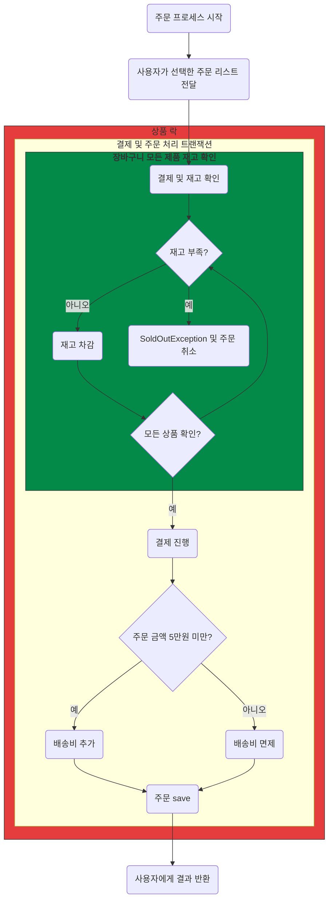
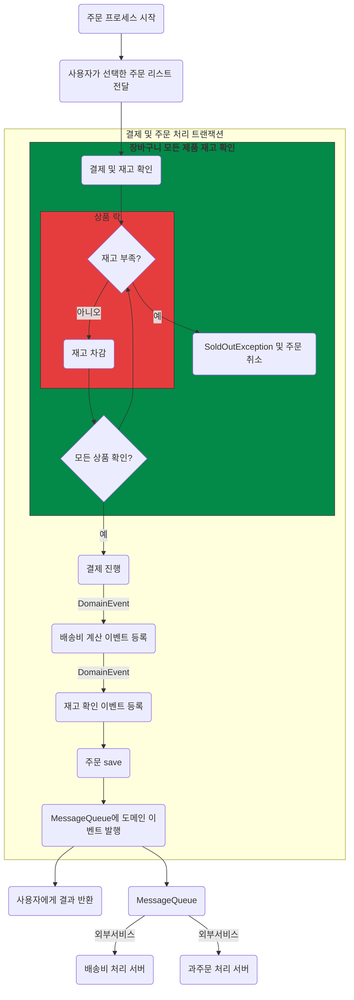
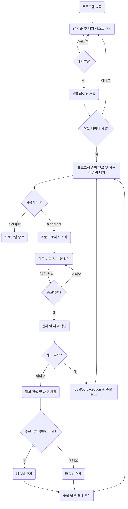

# 동시성의 문제

### 데이터베이스 트랜잭션과 격리성
#### 원자성(Atomicity)
    트랜잭션은 더 이상 분해가 불가능한 업무의 최소단위이므로, 전부 처리되거나 아예 하나도 처리되지 않아야 한다.
#### 일관성(Consistency)
      일관된 상태의 데이터베이스에서 하나의 트랜잭션을 성공적으로 완료하고 나면 그 데이터베이스는 여전히 일관된 상태여야 한다. 즉, 트랜잭션 실행의 결과로 데이터베이스 상태가 모순되지 않아야 한다.
#### 격리성(Isolation)
    실행 중인 트랜잭션의 중간결과를 다른 트랜잭션이 접근할 수 없다.
#### 영속성(Durability)
    트랜잭션이 일단 그 실행을 성공적으로 완료하면 그 결과는 데이터베이스에 영속적으로 저장된다.
### 비관적 락(pessimistic lock)
    비관적 락은 Reeatable Read 또는 Serializable 정도의 격리성 수준을 제공합니다.
    비관적 락이란 트랜잭션이 시작될 때 Shared Lock 또는 Exclusive Lock을 걸고 시작하는 방법입니다.
    즉, Shared Lock을 걸게 되면 write를 하기위해서는 Exclucive Lock을 얻어야하는데 Shared Lock이 다른 트랜잭션에 의해서 걸려 있으면
    해당 Lock을 얻지 못해서 업데이트를 할 수 없습니다.
    수정을 하기 위해서는 해당 트랜잭션을 제외한 모든 트랜잭션이 종료(commit) 되어야합니다.

1. Transaction_1 에서 table의 Id 2번을 읽음 ( name = Karol )
2. Transaction_2 에서 table의 Id 2번을 읽음 ( name = Karol )
3. Transaction_2 에서 table의 Id 2번의 name을 Karol2로 변경 요청 ( name = Karol )
하지만 Transaction 1에서 이미 shared Lock을 잡고 있기 때문에 Blocking
4. Transaction_1 에서 트랜잭션 해제 (commit)
5. Blocking 되어있었던 Transaction_2의 update 요청 정상 처리

### 낙관적 락(optimistic lock)
    낙관적 락은 DB 충돌 상황을 개선할 수 있는 방법 중 2번째인 수정할 때 내가 먼저 이 값을 수정했다고 명시하여 다른 사람이 동일한 조건으로 값을 수정할 수 없게 하는 것입니다.
    그런데 잘 보면 이 특징은 DB에서 제공해주는 특징을 이용하는 것이 아닌 Application Level에서 잡아주는 Lock입니다.

1. A가 table의 Id 2번을 읽음 ( name = Karol, version = 1 )
2. B가 table의 Id 2번을 읽음 ( name = Karol, version = 1 )
3. B가 table의 Id 2번, version 1인 row의 값 갱신 ( name = Karol2, version = 2 ) 성공
4. A가 table의 Id 2번, version 1인 row의 값 갱신 ( name = Karol1, version = 2 ) 실패
5. Id 2번은 이미 version이 2로 업데이트 되었기 때문에 A는 해당 row를 갱신하지 못함
6. 위 flow를 통해서 같은 row에 대해서 각기 다른 2개의 수정 요청이 있었지만 1개가 업데이트 됨에 따라 version이 변경되었기 때문에 뒤의 수정 요청은 반영되지 않게 되었습니다.
7. 이렇게 낙관적락은 version과 같은 별도의 컬럼을 추가하여 충돌적인 업데이트를 막습니다. version 뿐만 아니라 hashcode 또는 timestamp를 이용하기도 합니다.

## 동시 요청시 실 성능 비교
#### 폐쇄적인 락 case1 LockAcquisitionException 발생
    쓰레드 개수   시간           처리된 주문
    5000         4sec 842ms     1077
    10000        5sec 873ms     2889
    20000        11sec 320ms    5000
    30000        37sec 538ms    5000
#### 폐쇄적인 락 case2 LockAcquisitionException 발생
    쓰레드 개수   시간           처리된 주문
    5000         4sec 256ms     604
    10000        5sec 28ms      2812
    20000        11sec 44ms     4988
    30000        25sec 347ms    5000
#### 낙관적 락 case1 OptimisticLockException 발생
    쓰레드 개수   시간           처리된 주문
    5000         4sec 921ms     4515
    10000        5sec 970ms     10000
    20000        11sec 373ms    8638
    30000        23sec 383ms    5451
#### 낙관적인 락 case2 OptimisticLockException 발생
    쓰레드 개수  시간            처리된 주문
    5000        4sec 821ms      2282
    10000       4sec 848ms      10000
    20000       11sec 662ms     9077
    30000       21sec 407ms     5369

1. 폐쇄적인 락 (Pessimistic Lock)
   폐쇄적인 락 case1
   평균 처리 시간: 약 14,893ms
   총 주문 처리 수: 13,966개
   폐쇄적인 락 case2
   평균 처리 시간: 약 11,419ms
   총 주문 처리 수: 13,404개
2. 낙관적 락 (Optimistic Lock)
   낙관적 락 case1
   평균 처리 시간: 약 11,412ms
   총 주문 처리 수: 28,604개
   낙관적인 락 case2
   평균 처리 시간: 약 10,685ms
   총 주문 처리 수: 26,728개

## 대규모 서비스에서 동시성에서 중요한점
1. 트랜잭션 단위가 작아야한다.
2. 어느정도 오차는 나도 된다.
3. 모든게 한번에 이뤄질 필요는 없다.
- 연계된 서비스가 1~2초 뒤에 일어나도 사용자는 아무 불편이 없다.

### 폐쇄적 락 형식 @Transational 사용

### 낙관적 락 형식

## 소개

    이 프로젝트는 간단한 상품 주문 시스템을 구현한다.
    사용자는 여러 상품을 주문할 수 있으며,
    주문 프로세스는 상품 선택, 주문 수량 입력, 결제까지의 과정을 포함한다

### 개발 환경
- 언어: Java 17
- 데이터베이스: H2
- 추가 라이브러리: Spring Data JPA

### 주요 클래스
- Cashier : 주문 시스템에서 사용자와의 상호작용을 관리한다.
- ProductReader: 상품 데이터 csv파일을 읽어 배치로 입력한다.
- OrderReceiver: 고객의 요청을 Cart 에 담아준다.
- Cart: 전달 받은 주문 내역 중 정상 요청을 저장한다.
- OrderService: 비관적 락을 사용해 동시성 문제를 해결하며 주문 프로세스를 관리한다.
- ProductService: 상품의 주요 비지니스 로직을 담당한다.
- Product: 자신이 충분한 재고를 가지고 있는 지와 재고를 변경하는 책임을 갖는다.

### 요구사항 정의
- [x] 상품은 고유의 상품 번호, 상품명 판매가격, 재고 수량을 갖는다.
- [x] 한번에 여러개의 상품을 같이 주문할 수 있다.
- [x] 상품번호, 주문수량은 반복적으로 입력받는다.
- [x] 주문은 상품번호, 주문수량을 입력받는다.
  - [x] empty가 입력되었을 때, 해당 건에 대한 주문이 완료되고 결제한다.
  - [x] 결제 시 재고 확인을 하여야 하며 재고가 부족하면 SoldOutException이 발생한다.
- [x] 주문 금액이 5만원 미만인 경우 배송료 2,500원이 추가되어야 한다.
- [x] 주문이 완료되었을 경우 주문 내역, 결제 금액(배송비 포함)을 화면이 표출한다.
- [x] q or 'quit'을 입력하면 프로그램이 종료된다.
- [x] Test에서는 반드시 multi thread 요청으로 SoldOutException이 정상 동작하는 지 확인하는 단위 테스트가 필요하다.

### 상품주문_프로세스 

