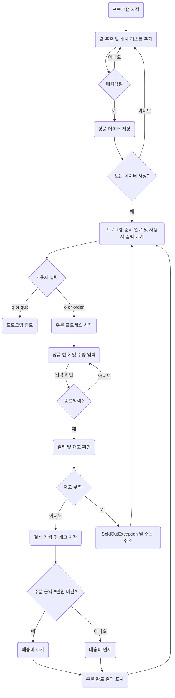

## 소개

    이 프로젝트는 간단한 상품 주문 시스템을 구현한다.
    사용자는 여러 상품을 주문할 수 있으며,
    주문 프로세스는 상품 선택, 주문 수량 입력, 결제까지의 과정을 포함한다

### 개발 환경
- 언어: Java 17
- 데이터베이스: H2
- 추가 라이브러리: Spring Data JPA

### 주요 클래스
- Cashier : 주문 시스템에서 사용자와의 상호작용을 관리한다.
- ProductReader: 상품 데이터 csv파일을 읽어 배치로 입력한다.
- OrderReceiver: 고객의 요청을 Cart 에 담아준다.
- Cart: 전달 받은 주문 내역 중 정상 요청을 저장한다.
- OrderService: 비관적 락을 사용해 동시성 문제를 해결하며 주문 프로세스를 관리한다.
- ProductService: 상품의 주요 비지니스 로직을 담당한다.
- Product: 자신이 충분한 재고를 가지고 있는 지와 재고를 변경하는 책임을 갖는다.

### 요구사항 정의
- [x] 상품은 고유의 상품 번호, 상품명 판매가격, 재고 수량을 갖는다.
- [x] 한번에 여러개의 상품을 같이 주문할 수 있다.
- [x] 상품번호, 주문수량은 반복적으로 입력받는다.
- [x] 주문은 상품번호, 주문수량을 입력받는다.
  - [x] empty가 입력되었을 때, 해당 건에 대한 주문이 완료되고 결제한다.
  - [x] 결제 시 재고 확인을 하여야 하며 재고가 부족하면 SoldOutException이 발생한다.
- [x] 주문 금액이 5만원 미만인 경우 배송료 2,500원이 추가되어야 한다.
- [x] 주문이 완료되었을 경우 주문 내역, 결제 금액(배송비 포함)을 화면이 표출한다.
- [x] q or 'quit'을 입력하면 프로그램이 종료된다.
- [x] Test에서는 반드시 multi thread 요청으로 SoldOutException이 정상 동작하는 지 확인하는 단위 테스트가 필요하다.

### 상품주문_프로세스 

